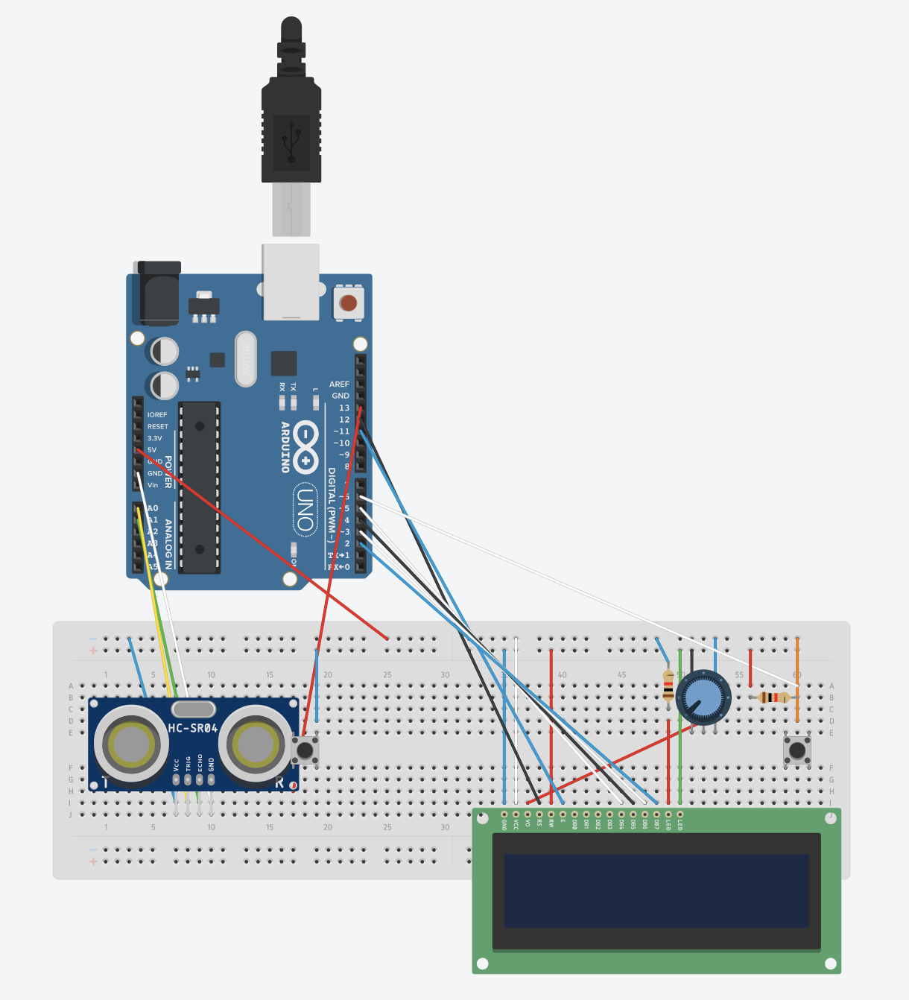

<h1>Projet Github Télémetre à Ultrason</h1>

<h2>Présentation :</h2>

    Le projet à été réalisé par Ambre, Jarell et Brévin. C'est un système composé d'une carte Arduino, un capteur ultrason et un écran LCD. Grâce au capteur la distance jusqu'à une zone et celle-ci s'affiche sur l'écran. Les mesures se font quand on appuit sur un bouton et la luminosité de l'écran est réglable grâce à un potentiometre. 

<h2>Fonctionnement du capteur :</h2>

    Le capteur HC-SR04 fonctionne sur le principe d’un sonar donc utilisant 2 signaux numérique :
    - Le premier signal appelé Trig – Trigger – génère un faisceau d’ultrasons. Les ultrasons sont réfléchis par la surface de l’objet dont on souhaite connaitre la distance. C’est le signal Echo que l’on récupère sur la seconde broche du capteur 
    Connaissant le temps entre l’émission du signal Trig et la réception Echo ainsi que la vitesse de propagation du son dans l’air on peut facilement en déduire la distance. 
    Il fonctionne avec une tension d'alimentation de 5 volts, dispose d'un angle de mesure de 15° environ et permet de faire des mesures de distance entre 2cm et 4,5m avec une précision de 3mm

<h2> Lancer le projet </h2>

Le projet necessite l'utilisation de l'extension PlateformIO disponnible sur VSC ainsi que de LiquidCrystal, une bibliothèque s'installant directement dans PlateformIO

  

